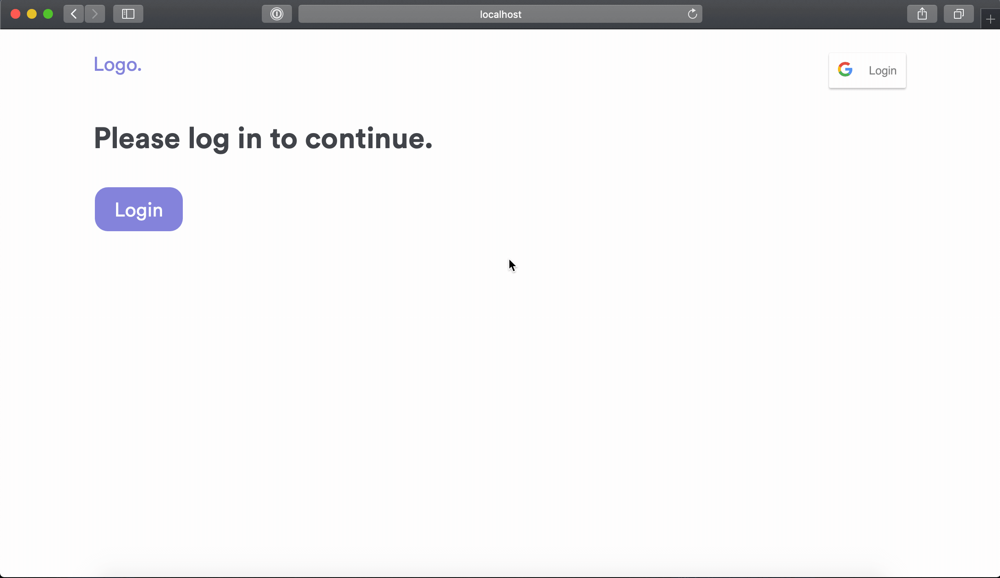

# react-redux-starter

Starter repository setup with create-react-app. Supports Dark Mode and Google
login powered by Redux.

To start,

clone the repository:

    git clone https://github.com/yagrawl/react-redux-starter.git
    cd react-redux-starter

Install all the required dependencies:

    npm install
    # or
    yarn add

Obtain your client ID for Google Login.

Visit [Google Developer Console](https://developers.google.com) and sign in with your google account. After you are logged in, go to the [Dashboard](https://console.developers.google.com/apis/dashboard). Then, **+ Create a new project** and Fill out the form. After you setup the project, head over to **OAuth consent screen** and select **External**. Then fill out the form. For **Authorized domains**, just fill out the domain you hope to host this app on.

After you are done submitting that form, move over to **Credentials** and **Create credentials**. Make sure to select **OAuth Client ID**. Application type is `Web server`. Name the key, and then in **Authorized JavaScript origins** and **Authorized redirect URIs** make sure to include `http://localhost:3000`. You can later update this to add it to the url where this app will be hosted.

You'll be provided a **Client ID**. Copy this ID and replace `GOOGLE_CLIENT_ID` within this project with your own **Client ID**.

[here](https://github.com/yagrawl/react-redux-starter/blob/master/src/components/elements/login.js#L55), [here](https://github.com/yagrawl/react-redux-starter/blob/master/src/components/elements/login.js#L74) and [here](https://github.com/yagrawl/react-redux-starter/blob/master/src/components/helpers/signin.js#L39).

The app should be up and running at `http://localhost:3000`.

Hopefully, this is what you should see :

